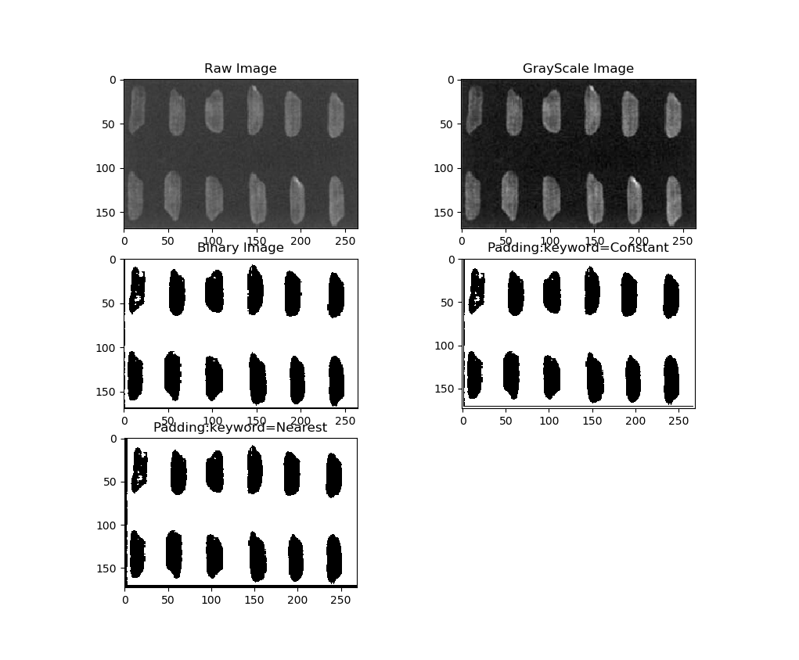
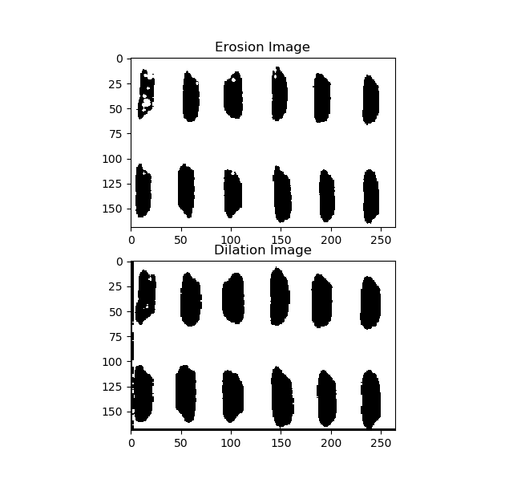
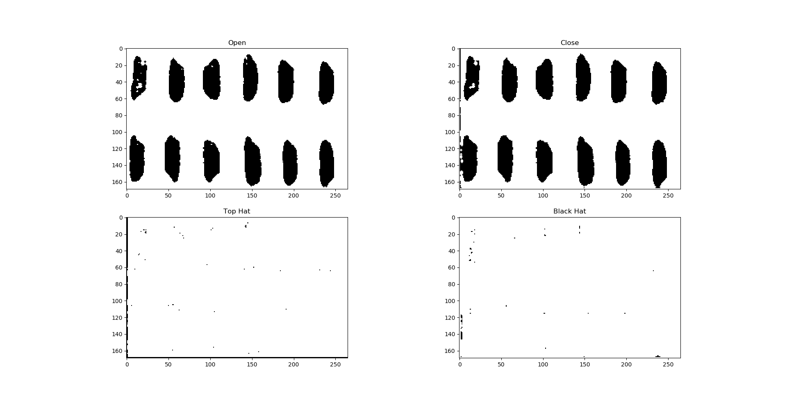

# Morlib帮助文档/About Morlib

Morlib是一个提供了二值图像基本相关操作的库。  
Morlib基于numpy开发，实现了包含阈值分割（Otsu法），膨胀，腐蚀，开运算，闭运算，顶帽/黑帽运算等形态学对二值图像的基本操作。  
因为使用了较原始的算法和简单的数据结构，相比OpenCV，Morlib运算可能更慢。
开发供学习之用。

Morlib is a library provides some basic operations for binary image.  
Morlib is based on numpy (only). Morlib includes basic operation like otsu, erosion, dilation, open, close, top hat, black hat.  
Due to the algorithm and the naive data structure, morlib performs bad compared to OpenCV functions.  
Developed for study only.
___

## 载入morlib/ Import morlib

```py
import morlib
# or
from morlib import *
```

## 函数/Function

### padding

```py
    def padding(img, kernal_size, border_filled):
        '''Used to add padding around the raw image.  
        Arguments:
            img {nparray} -- the input binary picture.
            kernel_size {tuple/list/ndarray} -- the size of the kernel used. Should be 2n+1,n>=0.
            border_filled {str} --  indicate the way border filled. 'CONSTANT' means filling with 0; 'NEAREST' will filled with nearest value.
        Returns:
            imgPadded {nparray} -- the image with values padded.
        '''
```

padding用于在图像周围添加一圈空白或从其周围取样的边框，边框大小由卷积核确定。padding函数能够使得在卷积的前后图像的大小不发生改变。使用padding的实例如图1。

padding is used to add a frame to the image, the size of the frame depends on the kernel. Using padding before the convolution makes the image keep the same size. The example is shown in Fig.1



___

### imgBinarization

```py
def imgBinarization(img, thershold=None):
    '''Binarization the given gray-image using given thershold.  
    If thershold isn't given, the function will choose the thershold via Otsu.
    Arguments:
        img {ndarray} -- the given gray-image. It should be a 2-d array.    
    Keyword Arguments:
        thershold {int} -- the thershold chosen.
    Returns:
        binary_img {ndarray} , thershold {int}
    '''
```

imgBinarization用于实现对灰度图像的二值化处理。当指定阈值时，该函数以指定阈值实现分割；当不指定分割阈值时，该函数使用Otsu法实现阈值的选择。  
该函数返回两个数据：二值图像和分割使用的阈值。使用该函数的实例也在图1中有显示。

imgBinarization is used to binarize the gray scale image. If the thershold was passed, the function will binarize with the given one; If not, the thershold will be determined via otsu algorithm.
imgBinarization returns the binary image with the thershold the function used. The example is also shown in fig 1.
___

## createKernel

```py
def createKernel(shape, keyword):
    '''A quick kernel creating function.
    
    Arguments:
        shape {array-like} -- the shape of the kernel.
        keyword {string} -- should be 'X' or 'rec'.  
        'X' creates kernel like(shape=(3,3)):[[0, 1, 0],
                                              [1, 1, 1],
                                              [0, 1, 0]]
        while 'rec' does(shape=(3,3)):[[1, 1, 1],
                                       [1, 1, 1],
                                       [1, 1, 1]]
    Returns:
        [ndarray] -- the kernel
    '''
```

createKernel能够快捷的生成指定关键字形态的形态学算子。目前该函数接受两种关键字：'X'与'rec'。其中'X'生成十字形形态学算子；'rec'生成矩形算子。具体的算子形状由shape参数定义。

createKernel gives a simple way to create common kernel, once you determine the size and the keyword. Now createKernel accepts 'X' and 'rec' as the keyword, in which 'X' creates the kernel with shape of crisscross, while the 'rec' creates which with the shape of rectangle. the height and width are defined by parameters shape.
___

## binary functions: 
包含binErosion/binDilation/binOpen/binClose/binTopHat/binBlackHat函数  
which including :binErosion/binDilation/binOpen/binClose/binTopHat/binBlackHat

```py
def binFunction(img, kernel, border_filled='CONSTANT'):
    # these functions share the same parameters format.
    # Attention: function binFunction does not exist. It represent the series of functions shown before.
    '''
    Arguments:
            img {nparray} -- the input binary picture.
            kernel {nparray} -- the kernel used. Whose length should be 2n+1,n>=0.
            border_filled {str} --  indicate the way border filled. 'CONSTANT' means filling with 0; 'NEAREST' will filled with nearest value.
    '''
```

所有的二值图像操作函数需要的参数相同且如上，以下不再赘述。  
binErosion/binDilation分别实现二值图像的腐蚀和膨胀。  
binOpen/binClose分别实现二值图像的开运算和闭运算。  
binTopHat/binBlackHat分别实现二值图像的顶帽运算和黑帽运算。  
一定要选择合适的边界处理条件。否则函数返回可能和OpenCV的结果存在差异。

All the binary operation functions accepts the same parameters, so there is only one example funtion above.
binErosion/binDilation realize the erosion and dilation. The example is shown in fig 2.


binOpen/binClose realize the open and close operation.
binTopHat/binBlackHat realize the top hat and the black hat operation.
These examples are shown in fig 3.

Do remember to choose the right frame filling way, or the processed image may perfrom different from the one of OpenCV.(Tested) 